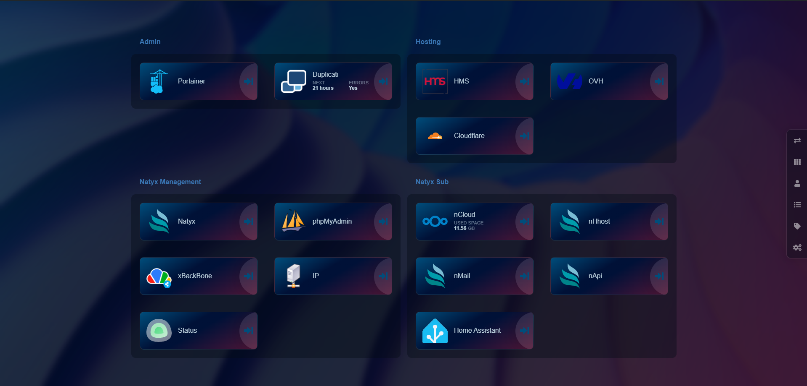
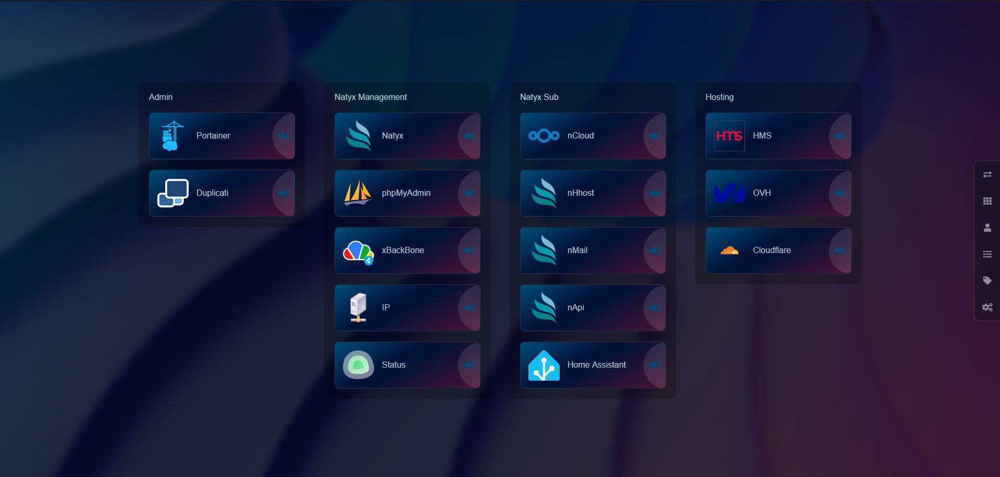

# Heimdall Tokyo Theme
*By Kirno*

## Images

<p align="center">
	
</p>



## Features

- Dark theme and color
- Tag packed in boxes
- New search bar
- Optimized code
- Fully customizable

## Things

List of things available in the github repo

| Object | Path |
| ------ | ------ |
| CSS | ./src/heimdall.css |
| JS | ./src/heimdall.js |
| IMAGE | ./img/background.png |
| DOC HOME | ./doc/home.png |
| DOC HOME NO LOG | ./doc/home_no_login.png |
| DOC HOME SEARCH | ./doc/home_search.png |

## ⚠️ Login Display ⚠️
> If you are not connected to the interface the boxes are displayed vertically and not grouped.
> If you don't want this feature, you can change it in the js by deleting line 105 and 106.

```js
105.        container.html("");
106.        container.css("opacity", "1");
```